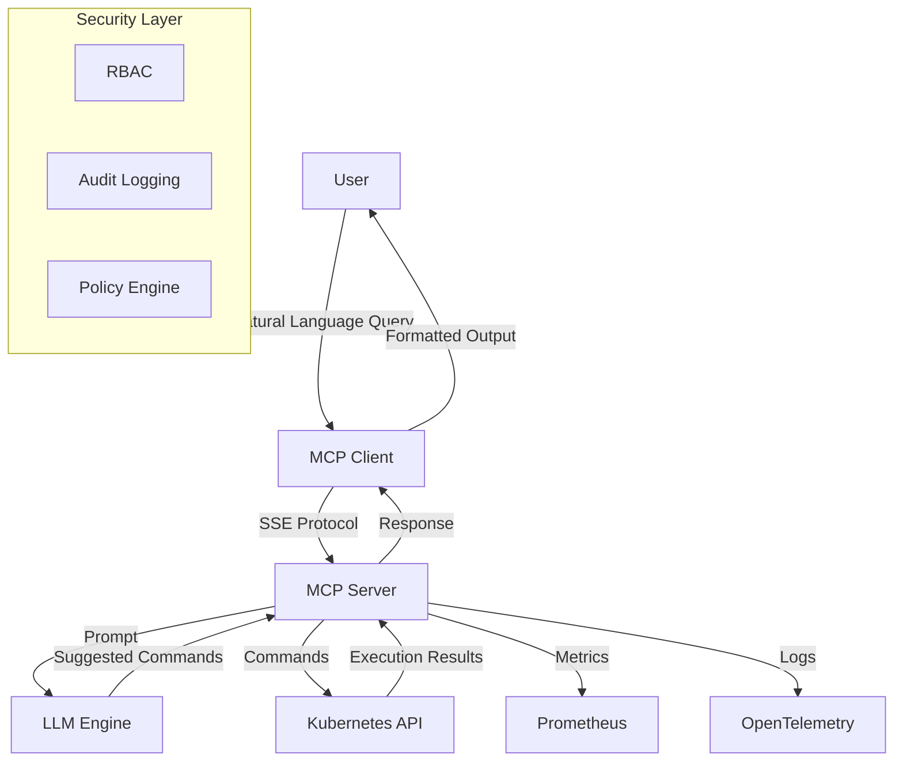

# K8s AI Agent (KAI)

An intelligent AI-powered agent for Kubernetes that helps DevOps engineers and developers manage cloud-native infrastructure through natural language interactions.


## 🎯 Vision

KAI aims to democratize Kubernetes operations by providing an AI assistant that can:
- Translate natural language requests into proper Kubernetes commands
- Execute complex operations safely
- Provide explanations and learning opportunities
- Integrate with the broader CNCF ecosystem

## 🏗 Architecture



## 🌟 Key Features

### Current Features
- ✅ Natural language to kubectl command translation
- ✅ Real-time command execution
- ✅ SSE-based communication
- ✅ Local LLM support via Ollama

### Planned Features

#### 1. Core Kubernetes Integration
- [ ] Cluster state awareness
- [ ] Resource validation before execution
- [ ] Multi-cluster support
- [ ] Custom resource definition (CRD) awareness
- [ ] Kubernetes events monitoring

#### 2. Security & Compliance
- [ ] Role-Based Access Control (RBAC) integration
- [ ] Policy enforcement (OPA/Gatekeeper)
- [ ] Audit logging
- [ ] Sensitive operation confirmation
- [ ] Command dry-run support

#### 3. CNCF Integration
- [ ] Prometheus metrics integration
- [ ] OpenTelemetry observability
- [ ] Argo CD workflow automation
- [ ] Tekton pipeline integration
- [ ] Service mesh awareness (Istio/Linkerd)

#### 4. AI Capabilities
- [ ] Context-aware responses
- [ ] Learning from past interactions
- [ ] Best practices recommendations
- [ ] Troubleshooting assistance
- [ ] Performance optimization suggestions

#### 5. Developer Experience
- [ ] Interactive CLI with autocompletion
- [ ] Web UI dashboard
- [ ] VS Code extension
- [ ] Integration with popular CI/CD platforms
- [ ] API for third-party integrations

## 🚀 Getting Started

### Prerequisites
- Kubernetes cluster
- Ollama or compatible LLM
- Go 1.21+
- kubectl configured

### Installation
```bash
# Clone the repository
git clone https://github.com/jaiakash/k8s-ai-agent
cd k8s-ai-agent

# Install dependencies
go mod download

# Start the server
go run server/server.go --kubeconfig=$HOME/.kube/config

# In another terminal, start the client
go run client/client.go
```

## 🔧 Configuration

```yaml
# config.yaml
llm:
  provider: "ollama"
  model: "deepseek-r1"
  endpoint: "http://localhost:11434"

kubernetes:
  contexts:
    - name: "production"
      kubeconfig: "~/.kube/config"
      rbac:
        enabled: true
        role: "viewer"

security:
  audit: true
  policyEngine: "opa"
  dryRun: true
```

## 🤝 Contributing

We welcome contributions! Please see our [Contributing Guide](CONTRIBUTING.md) for details.

## 📝 Example Usage

```bash
> KAI, scale the frontend deployment to 5 replicas
Understanding request... ✓
Validating resources... ✓
Command to execute: kubectl scale deployment frontend --replicas=5
Executing... ✓
Successfully scaled deployment "frontend" to 5 replicas

> KAI, show me the pods that are using too much memory
Analyzing metrics... ✓
Found 2 pods exceeding memory thresholds:
1. nginx-pod-1: 85% memory usage
2. redis-pod-2: 92% memory usage
Suggested command: kubectl top pods | sort -k4 -nr
```

## 📊 Roadmap

[In Progress]

## 📜 License

MIT License - see [LICENSE](LICENSE) for details
