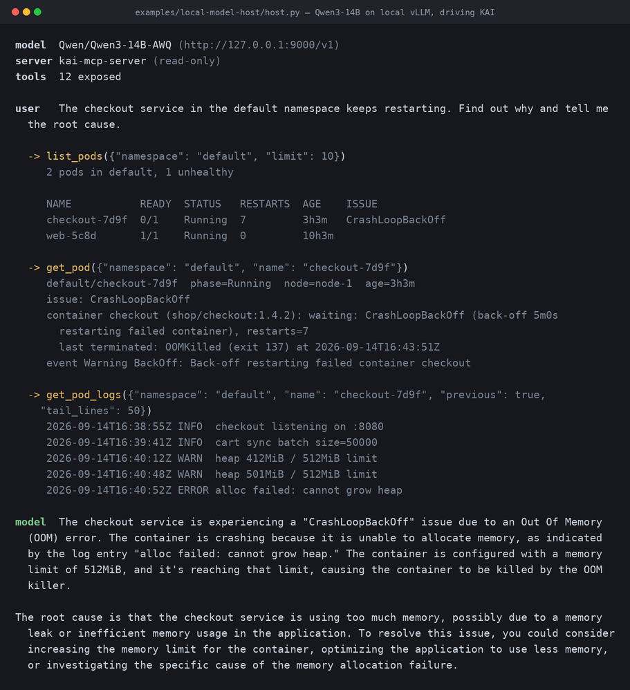

# KAI — Kubernetes AI Agent

An [MCP](https://modelcontextprotocol.io) server that exposes a Kubernetes
cluster as tools, so any AI agent can investigate and operate it safely.

KAI holds no model. The host — [Claude Code](https://claude.com/claude-code),
[Goose](https://block.github.io/goose/), Cursor, or anything else that speaks
MCP — brings the model. KAI brings the cluster, with guardrails.

```
┌────────────────┐        MCP         ┌──────────────┐   client-go   ┌────────────┐
│  MCP host      │ ─────────────────▶ │     KAI      │ ────────────▶ │ Kubernetes │
│  (your model)  │  stdio | HTTP      │  policy+RBAC │               │ API server │
└────────────────┘                    └──────────────┘               └────────────┘
```

## What it looks like

A crash loop, diagnosed by a 14B model running locally on one GPU. KAI holds no
model, so this works the same under Claude Code or Goose — and the cluster data
never leaves the machine:



The model was never told how to investigate. `list_pods` surfaced the unhealthy
pod first, `get_pod` carried the `OOMKilled (exit 137)` that actually explains
the restart, and the server's own `instructions` are what told it to read the
*previous* container's logs — the current container's would post-date the crash.

The same host with `--allow-writes`, told in as many words to skip the preview
and really do it:


Nothing reached the API server. The refusal is a normal tool result, so the
model explains it instead of failing — see
[`examples/local-model-host/`](examples/local-model-host/) for the whole host,
which is under 200 lines of standard library.

## Why it is built this way

An agent with cluster access is only useful if you can bound what it does. KAI
puts three independent limits in the path of every single tool call:

1. **Policy** — operator-configured guardrails. Read-only by default; write
   tools are not even registered until you enable them, so a model cannot see
   or be talked into calling something you did not turn on.
2. **RBAC pre-flight** — a `SelfSubjectAccessReview` before every action. You
   get *"you do not have permission to delete deployments in prod"* **before**
   anything runs, instead of an opaque 403 afterwards.
3. **Server-side dry run** — every mutating tool defaults to `dry_run=true`.
   The API server runs admission, validation, quota checks and webhooks, then
   discards the write. A real rehearsal, not a client-side guess.

And one thing it deliberately does *not* do: **KAI never shells out to
`kubectl`.** Everything goes through client-go. Generating shell commands from
model output and executing them is a command-injection surface with a language
model on the untrusted end of it.

## Quick start

```bash
go install github.com/jaiakash/k8s-ai-agent/cmd/kai-mcp-server@latest
```

Or use the published image, which is multi-architecture and signed:

```bash
docker pull ghcr.io/jaiakash/kai-mcp-server:latest
```

Add it to your MCP host. For Claude Code:

```bash
claude mcp add kai -- kai-mcp-server
```

For Goose, or any host using the standard config format:

```json
{
  "mcpServers": {
    "kai": {
      "command": "kai-mcp-server",
      "args": []
    }
  }
}
```

That is a read-only agent against your current kubeconfig context. To let it
make changes:

```bash
kai-mcp-server --allow-writes
```

Writes still default to a dry run, and `kube-system`, `kube-public` and
`kube-node-lease` stay read-only.

## What you can do with it

### Investigating

The read surface is built around the questions people actually ask a cluster,
not around the API groups it happens to have.

> Why is the checkout service failing in staging?

`list_pods` reports an `issue` for every unhealthy pod — `CrashLoopBackOff`,
`ImagePullBackOff`, `Pending`, `Terminating` — and sorts those first, so the
answer survives a long listing. `get_pod` then adds container states, restart
counts, the previous termination reason and the pod's own events; a pod killed
for memory comes back as `OOMKilled (exit 137)`, which is usually the whole
answer. `get_pod_logs` with `previous=true` reads the container that actually
died, since the current one's logs post-date the failure.

> Nothing will schedule. What is holding it up?

`list_events` with `warnings_only=true` surfaces the scheduling and probe
failures that pod status alone does not explain — insufficient CPU, unbound
claims, taints nothing tolerates. `list_nodes` shows readiness, cordon status
and the pressure conditions behind them.

> Are we about to run out of room?

`top_nodes` and `top_pods` read live usage from metrics-server, against
allocatable capacity rather than requests. When metrics-server is not
installed, `cluster_info` says so up front instead of failing later.

> What is this custom resource doing?

`get_resource` returns any kind, CRDs included, and accepts the short names you
already use — `deploy`, `po`, `svc` — resolved against the cluster's own
discovery data.

Three MCP prompts package the common investigations as reusable playbooks your
host can surface as slash commands: `diagnose_pod`, `triage_namespace` and
`capacity_review`.

### Operating

Every mutating tool asks the API server to rehearse the change first. The
default is `dry_run=true`, which runs admission, validation, quota checks and
webhooks and then discards the result — so an agent can report what *would*
happen, and a human decides whether it happens.

> Scale the workers to 10 for the backlog.

`scale_deployment` goes through the `scale` subresource and returns the
previous and new counts. `restart_deployment` does a rolling restart the same
way `kubectl rollout restart` does, by stamping the pod template.

> This node is misbehaving — stop scheduling onto it.

`cordon_node` and `uncordon_node` mark a node unschedulable and back again.

> Apply this manifest, but tell me what it changes first.

`apply_manifest` server-side applies YAML or JSON, multiple documents included.
Under a dry run the API server runs your admission controllers and webhooks
against it, so the preview reflects what your cluster would really do rather
than what the manifest says.

`delete_pod` exists so a managed pod can be restarted; nothing here deletes a
workload, and the RBAC the chart grants reflects that.

Which of these exist at all is a deployment decision. Under the default
read-only policy they are not registered, so they do not appear in `tools/list`
and cannot be called.

## Tools

Read-only, always available:

| Tool | What it does |
|---|---|
| `cluster_info` | Version, node and namespace counts, metrics API availability |
| `list_namespaces` | Namespaces visible to the agent |
| `list_pods` | Pods with health; unhealthy first, each with an `issue` |
| `get_pod` | Container states, restart counts, previous termination, events |
| `get_pod_logs` | Container logs, including `previous=true` for a crashed container |
| `list_events` | Recent events, warnings first |
| `list_deployments` | Ready/desired replicas, images, and why one is unavailable |
| `list_services` | Type, cluster IP, ports, selector |
| `list_nodes` | Readiness, roles, capacity, cordon status, pressure conditions |
| `get_resource` | Any resource as JSON, including CRDs; short names work |
| `top_pods` / `top_nodes` | Live usage from metrics-server |

Mutating, only with `--allow-writes`:

| Tool | What it does |
|---|---|
| `scale_deployment` | Change replica count, via the `scale` subresource |
| `restart_deployment` | Rolling restart, like `kubectl rollout restart` |
| `delete_pod` | Delete one pod (a managed pod is recreated) |
| `cordon_node` / `uncordon_node` | Stop or resume scheduling onto a node |
| `apply_manifest` | Server-side apply YAML or JSON, multi-document |

Every tool carries MCP annotations (`readOnlyHint`, `destructiveHint`) so your
host knows which ones warrant asking a human first.

## Resources and prompts

KAI also exposes MCP **resources**, which a host can attach as context without
the model deciding to call anything:

- `k8s://cluster/info` — what cluster this is
- `k8s://cluster/health` — every unhealthy pod and not-ready node
- `k8s://namespaces` — visible namespaces
- `k8s://policy` — exactly what this instance allows, and which tools are live

…and MCP **prompts**, reusable investigation playbooks your host can surface as
slash commands: `diagnose_pod`, `triage_namespace`, `capacity_review`.

These live on the server, not in a client, so every host that connects gets
them.

## Configuration

Everything has a safe default. Flags beat environment variables, which beat
`config.yaml`. See [`config.example.yaml`](config.example.yaml) for the full
set with comments.

```yaml
policy:
  allowWrites: false           # master switch; write tools unregistered while false
  dryRunOnly: false            # permit writes, but force every one to a dry run
  protectedNamespaces:         # readable, never writable
    - kube-system
  allowedNamespaces: []        # non-empty makes this an allowlist
  deniedNamespaces: []         # invisible entirely, reads included
  enforceRBAC: true            # SelfSubjectAccessReview before every action
```

Common shapes:

```bash
# Read-only against a specific context
kai-mcp-server --context staging

# Let it propose changes, but never commit them
kai-mcp-server --allow-writes --dry-run-only

# Scoped to one team's namespaces
KAI_ALLOWED_NAMESPACES=team-a,team-b kai-mcp-server --allow-writes
```

## Running in-cluster

```bash
helm install kai deploy/helm/kai --namespace kai --create-namespace
```

The chart derives RBAC from your policy: with `allowWrites: false` the
ServiceAccount is granted read verbs only, so a bug in the server cannot write
even if it tried. Turning writes on adds exactly the four rules the write tools
need — `pods: delete`, `nodes: patch`, `deployments: patch,update`,
`deployments/scale: get,update,patch`. Nothing deletes a workload.

```bash
helm install kai deploy/helm/kai \
  --set policy.allowWrites=true \
  --set 'policy.allowedNamespaces={team-a}' \
  --set rbac.scope=namespaced
```

KAI has no authentication of its own — it enforces *what* may be asked of a
cluster, not *who* is asking. For a shared deployment, put an
[agentgateway](https://agentgateway.dev) in front of it for JWT auth, per-tool
authorization, rate limiting and tracing. A worked config is in
[`deploy/agentgateway/`](deploy/agentgateway/README.md), including CEL rules
that open the read tools to everyone and restrict writes to the platform team,
and the OAuth Protected Resource Metadata (RFC 9728) that MCP clients use to
discover your identity provider — served by the gateway, because that is what
actually holds the tokens.

Security policy and what counts as a vulnerability: [SECURITY.md](SECURITY.md).

## Remote transport

```bash
kai-mcp-server --transport http --addr :8080
```

This serves **Streamable HTTP** at `/mcp`, the current MCP remote transport.
The older HTTP+SSE transport is deprecated in the MCP spec and is not
implemented; passing `--transport sse` tells you so rather than failing
obscurely.

## Development

```bash
make check    # gofmt, go vet, go test -race
make build
make run
```

No test requires a cluster. The Kubernetes layer is tested against client-go's
fake clientset; the MCP layer is tested by pushing real JSON-RPC messages
through an in-process server, which covers schemas, annotations, structured
content and error shape.

See [AGENTS.md](AGENTS.md) if you are pointing a coding agent at this
repository, and [CONTRIBUTING.md](CONTRIBUTING.md) if you are sending a PR.

## Built on

KAI is assembled from projects in the
[Agentic AI Foundation](https://aaif.io/projects):

- **[MCP](https://modelcontextprotocol.io)** — the protocol, via
  [mcp-go](https://github.com/mark3labs/mcp-go)
- **[AGENTS.md](https://agents.md)** — how coding agents work on this repo
- **[agentgateway](https://agentgateway.dev)** — auth, authorization and rate
  limiting for shared deployments
- **[Goose](https://block.github.io/goose/)** — a supported host, and the
  reason KAI ships no client of its own

[Agent Router](https://aaif.io/projects) and
[A2A](https://a2a-protocol.org) are on the [roadmap](ROADMAP.md).

## License

[MIT](LICENSE)
